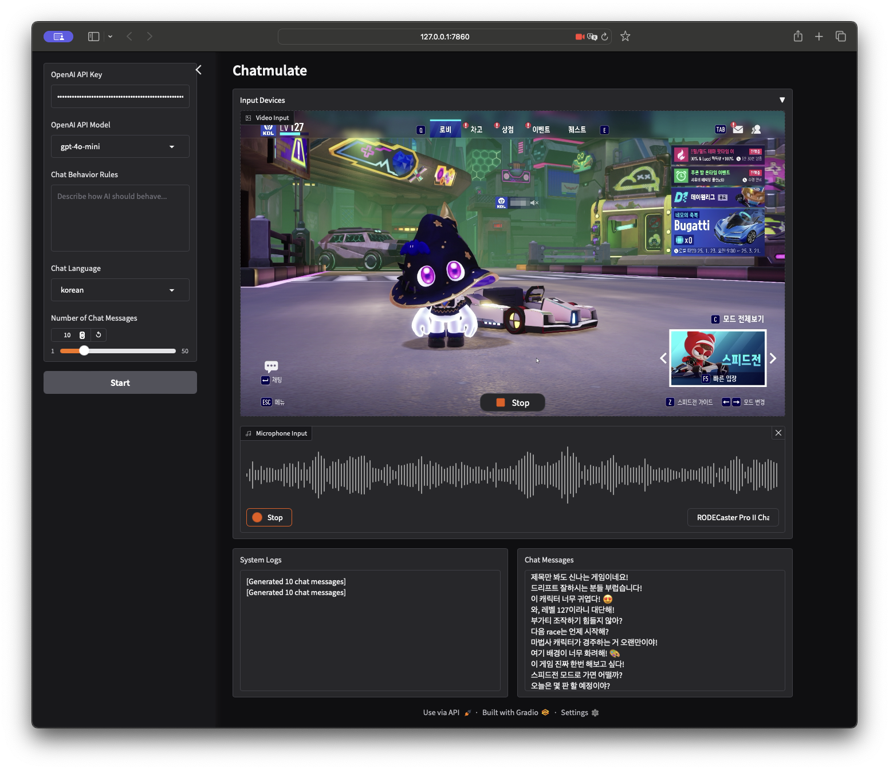

# Chatmulate

[](https://hits.sh/github.com/silentsoft/chatmulate/)

**Chatmulate** is a real-time, multimodal AI chat simulator that captures video and audio streams from your webcam and microphone, processes the data using OpenAI APIs, and generates engaging AI chat messages.
Built with Python and Gradio, this application is ideal for streaming and creative AI-driven content generation.



## Features

- **Real-time Streaming:**  
  Captures webcam frames every 2 seconds and records audio every 10 seconds.
- **Multimodal Data Processing:**  
  Combines audio transcriptions (via OpenAI Whisper) with selected video frames to create contextual inputs for AI chat generation.
- **Customizable Chat Generation:**  
  Supports user-defined chat behavior rules, language selection, and the number of AI-generated chat responses.

## Prerequisites

1. Install `Poetry`
   ```shell
   $ curl -sSL https://install.python-poetry.org | python3 -
   ```

## Installation

1. Clone the repository:
   ```shell
   $ git clone https://github.com/silentsoft/chatmulate.git
   $ cd chatmulate
   ```

2. Install Dependencies:
   ```shell
   $ poetry install
   ```

## Usage

1. Activate the `Poetry` virtual environment:
   ```shell
   $ poetry shell
   ```

2. Run the app with `OPENAI_API_KEY`:
   ```shell
   $ OPENAI_API_KEY="YOUR-API-KEY-HERE" chatmulate
   ```

3. Open your browser:
    - The app will run at http://127.0.0.1:7860.

## Contributing
Pull requests are welcome. For major changes, please open an issue first to discuss what you would like to change.

Please note we have a [CODE_OF_CONDUCT](https://github.com/silentsoft/chatmulate/blob/main/CODE_OF_CONDUCT.md), please follow it in all your interactions with the project.

## License
This project is licensed under the MIT License. See the [LICENSE](https://github.com/silentsoft/chatmulate/blob/main/LICENSE.txt) file for details.
